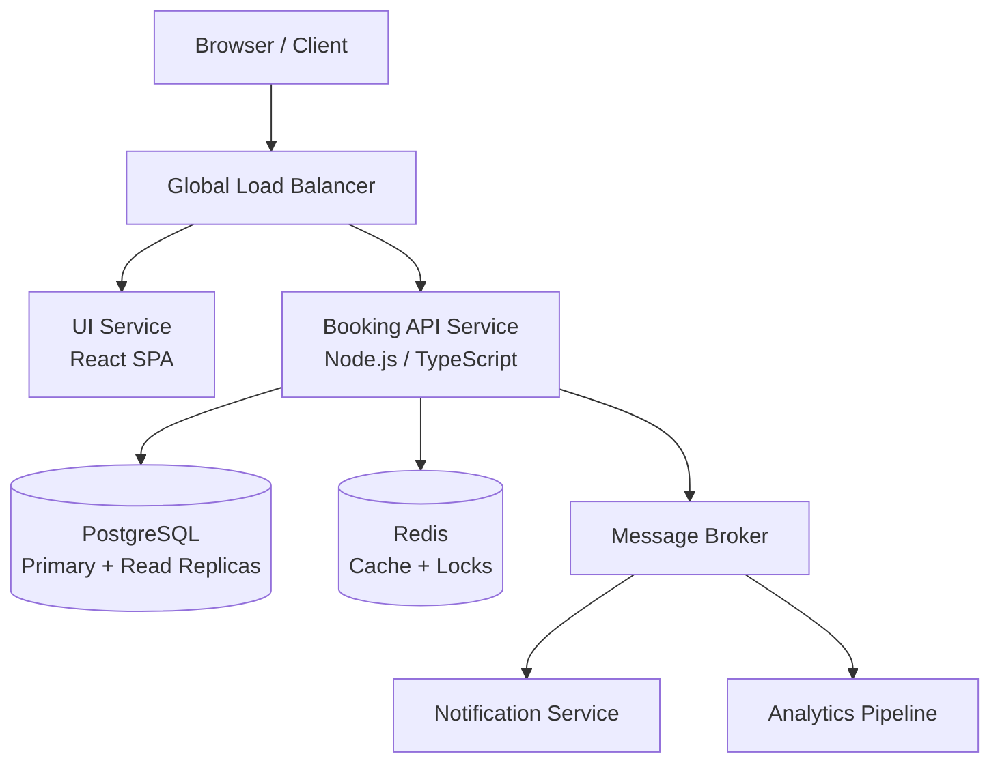

## 1. Architecture Diagram


UI Service:
    The UI Service serves the React single-page application.
    It communicates exclusively with the Booking API Service via HTTPS.
    It can be deployed as a standalone microservice or as a static asset hosted on a CDN.

Booking API Service :
    The Booking API Service is the core backend responsible for:
    User registration and authentication
    Room search
    Room booking
    It is stateless and horizontally scalable,
    The service communicates with PostgreSQL, Redis, and the message broker to support caching, persistence, and asynchronous workflows.

PostgreSQL:  
    PostgreSQL is used as the source of truth for:
    Users
    Rooms
    Bookings
    Room availability
    The deployment includes:
    Primary writer node
    Read replicas to offload read-heavy operations such as room search
    This ensures high consistency for bookings while allowing scalable search performance.

Redis:
    Redis is used for:
    Caching room details and availability
    Distributed locking in the booking flow to prevent double-booking
    This improves performance and ensures safe concurrent operations.

message broker (Kafka / RabbitMQ / SQS):
    is used to publish domain events such as:
    UserRegistered
    BookingCreated
    These events are consumed by:
    Notification Service (emails/SMS)
    Analytics Pipeline
    This ensures booking flows remain fast and asynchronous operations do not block API responses.

The system supports multi-region deployment with:
    A global load balancer routing users to the closest healthy region
    Local Redis and API instances in each region
    PostgreSQL primary in one region and read replicas in others.


## 2. API Design

The system exposes a RESTful HTTP API, consumed by the UI service.  
All endpoints are namespaced under `/api/`.

- Base URL (example): `https://api.my-room-booking.com/api/`

Authentication is based on JWT (JSON Web Tokens).  
Public endpoints: user registration and login.  
All other endpoints require a valid `Authorization: Bearer <token>` header.

---

### 2.1 Endpoint Overview

| Endpoint                   | Method | Auth Required | Description                          |
|---------------------------|--------|---------------|--------------------------------------|
| `/auth/register`         | POST   | No            | Register a new user                  |
| `/auth/login`            | POST   | No            | Login and obtain JWT                 |
| `/rooms`                 | GET    | Yes           | Search for available rooms           |
| `/bookings`              | POST   | Yes           | Create a new booking                 |
| `/health`                | GET    | No            | Health-check for monitoring          |

All responses are JSON.

---

### 2.2 Authentication

#### 2.2.1 Register User

**Endpoint**

- `POST /api/auth/register`

**Request body**

```json
{
  "email": "user@example.com",
  "password": "StrongPassword123!",
  "fullName": "John Doe"
}

Response (201 Created)
{
  "id": "user_123",
  "email": "user@example.com",
  "fullName": "John Doe",
  "createdAt": "2025-11-30T12:00:00.000Z"
}
```
Passwords are never stored in plain text – only as salted, hashed values (e.g., using bcrypt).

#### 2.2.2 Login

**Endpoint**

- `POST /api/auth/login`

**Request body**
```json
{
  "email": "user@example.com",
  "password": "StrongPassword123!"
}
Response (200 OK)
{
  "accessToken": "jwt-token-here",
  "tokenType": "Bearer",
  "expiresIn": 3600,
  "user": {
    "id": "user_123",
    "email": "user@example.com",
    "fullName": "John Doe"
  }
}
```
The accessToken is a signed JWT containing:

sub – user id

email

exp – expiration time

The UI passes this token on subsequent requests via:
Authorization: Bearer <accessToken>

### 2.3 Room Search

**Endpoint**

- `GET /api/rooms`

# Description

Returns a list of rooms that match search criteria and are available for the requested date range.

Query parameters (examples)

location (optional, string) – e.g. "tel-aviv"

capacity (optional, number) – minimum number of people

checkIn (required, ISO date) – e.g. 2025-12-01

checkOut (required, ISO date) – e.g. 2025-12-05

page (optional, default 1)

pageSize (optional, default 20)

#Example request:
GET /api/v1/rooms?location=tel-aviv&capacity=4&checkIn=2025-12-01&checkOut=2025-12-05&page=1&pageSize=20
Authorization: Bearer <token>

#Response (200 OK):
```json
{
  "items": [
    {
      "id": "room_101",
      "name": "Deluxe Sea View",
      "location": "tel-aviv",
      "capacity": 4,
      "pricePerNight": 120,
      "currency": "USD",
      "amenities": ["wifi", "air_conditioning", "tv"],
      "isAvailable": true
    }
  ],
  "page": 1,
  "pageSize": 20,
  "total": 1
}
```
Internally, the API uses:

PostgreSQL for authoritative availability & pricing

Redis for caching recent search results / room metadata

### 2.4 Create Booking

**Endpoint**

- `POST /api/v1/bookings`

#Description

Creates a booking for a specific room and date range, if the room is still available.
This endpoint is write-critical and uses locking / transactions to prevent double-booking (explained in section 4).

**Request body**
```json
{
  "roomId": "room_101",
  "checkIn": "2025-12-01",
  "checkOut": "2025-12-05",
  "guests": 2,
  "paymentMethodId": "pm_12345"
}
```
The authenticated user is derived from the JWT (sub claim), so no userId is required in the payload.

#Response (201 Created)
```json 
{
  "id": "booking_987",
  "roomId": "room_101",
  "userId": "user_123",
  "checkIn": "2025-12-01",
  "checkOut": "2025-12-05",
  "guests": 2,
  "totalPrice": 480,
  "currency": "USD",
  "status": "CONFIRMED",
  "createdAt": "2025-11-30T12:34:56.000Z"
}
```
Error example (409 Conflict – room no longer available)
```json
{
  "error": "ROOM_NOT_AVAILABLE",
  "message": "The selected room is no longer available for the requested dates."
}
```

####2.5 Health Check

**Endpoint**

- `GET /api/v1/health`

#Description

Simple health endpoint used by load balancers and monitoring systems.

#Response (200 OK)
```json
{
  "status": "ok",
  "uptimeSeconds": 12345,
  "version": "1.0.0"
}
```
####2.6 Error Handling & Response Format

All error responses follow a consistent JSON structure:
```json
{
  "error": "ERROR_CODE",
  "message": "Human readable description",
  "details": {
    "field": "optional extra context"
  }
}
```

Example validation error (400 Bad Request):
```json
{
  "error": "VALIDATION_ERROR",
  "message": "Invalid input data",
  "details": {
    "checkIn": "checkIn must be before checkOut"
  }
}
```

####2.7 Rate Limiting

Rate Limiting is used to prevent abuse and ensure fair usage by restricting how many requests a client can send within a given time window. The implementation can be done using Redis with a token bucket or fixed-window counter.

Suggested strategy:

Per IP for unauthenticated endpoints (e.g., /auth/login, /auth/register)

Per userId for authenticated endpoints

Example policy:

100 requests per 15 minutes per IP for public endpoints

300 requests per 15 minutes per authenticated user

Stricter limits (e.g., 20 requests per minute) on /bookings to prevent booking spam

When a client exceeds the limit, the API responds with:

HTTP 429 Too Many Requests

{
  "error": "RATE_LIMIT_EXCEEDED",
  "message": "Too many requests. Please try again later."
}


The implementation can be done using a Redis-based token bucket or fixed-window counter (e.g., userId:timestamp keys with TTL).

