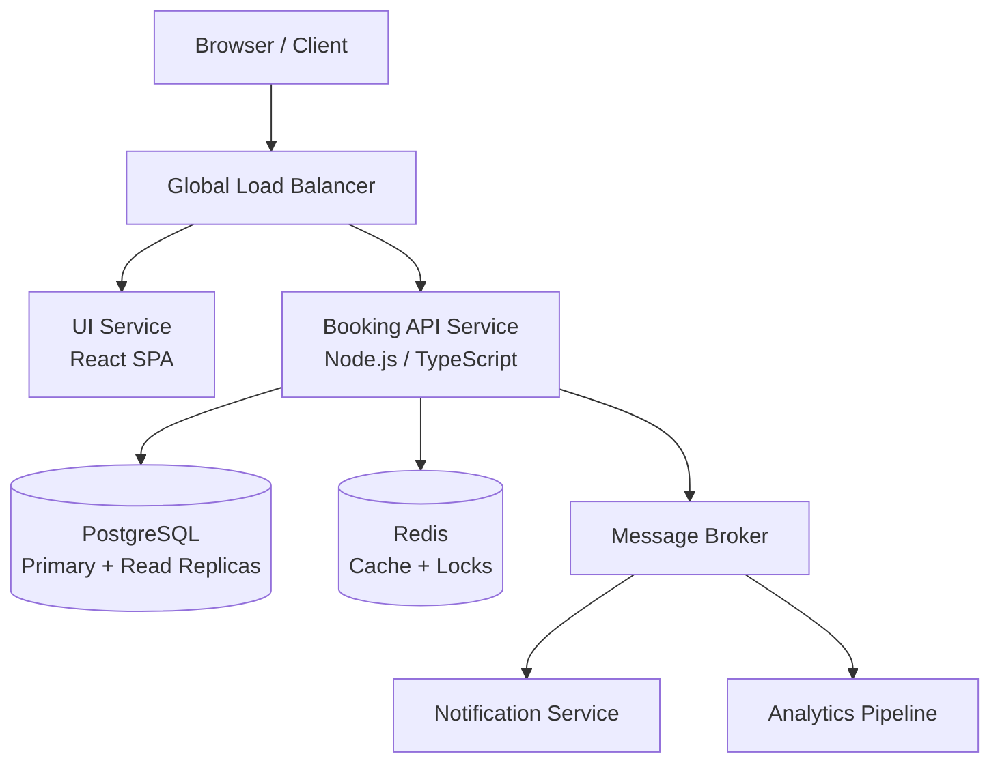

## 1. Architecture Diagram


UI Service:
    The UI Service serves the React single-page application.
    It communicates exclusively with the Booking API Service via HTTPS.
    It can be deployed as a standalone microservice or as a static asset hosted on a CDN.

Booking API Service :
    The Booking API Service is the core backend responsible for:
    User registration and authentication
    Room search
    Room booking
    It is stateless and horizontally scalable,
    The service communicates with PostgreSQL, Redis, and the message broker to support caching, persistence, and asynchronous workflows.

PostgreSQL:  
    PostgreSQL is used as the source of truth for:
    Users
    Rooms
    Bookings
    Room availability
    The deployment includes:
    Primary writer node
    Read replicas to offload read-heavy operations such as room search
    This ensures high consistency for bookings while allowing scalable search performance.

Redis:
    Redis is used for:
    Caching room details and availability
    Distributed locking in the booking flow to prevent double-booking
    This improves performance and ensures safe concurrent operations.

message broker (Kafka / RabbitMQ / SQS):
    is used to publish domain events such as:
    UserRegistered
    BookingCreated
    These events are consumed by:
    Notification Service (emails/SMS)
    Analytics Pipeline
    This ensures booking flows remain fast and asynchronous operations do not block API responses.

The system supports multi-region deployment with:
    A global load balancer routing users to the closest healthy region
    Local Redis and API instances in each region
    PostgreSQL primary in one region and read replicas in others.


## 2. API Design

The system exposes a RESTful HTTP API, consumed by the UI service.  
All endpoints are namespaced under `/api/`.

- Base URL (example): `https://api.my-room-booking.com/api/`

Authentication is based on JWT (JSON Web Tokens).  
Public endpoints: user registration and login.  
All other endpoints require a valid `Authorization: Bearer <token>` header.

---

### 2.1 Endpoint Overview

| Endpoint                   | Method | Auth Required | Description                          |
|---------------------------|--------|---------------|--------------------------------------|
| `/auth/register`         | POST   | No            | Register a new user                  |
| `/auth/login`            | POST   | No            | Login and obtain JWT                 |
| `/rooms`                 | GET    | Yes           | Search for available rooms           |
| `/bookings`              | POST   | Yes           | Create a new booking                 |
| `/health`                | GET    | No            | Health-check for monitoring          |

All responses are JSON.

---

### 2.2 Authentication

#### 2.2.1 Register User

**Endpoint**

- `POST /api/auth/register`

**Request body**

```json
{
  "email": "user@example.com",
  "password": "StrongPassword123!",
  "fullName": "John Doe"
}

Response (201 Created)
{
  "id": "user_123",
  "email": "user@example.com",
  "fullName": "John Doe",
  "createdAt": "2025-11-30T12:00:00.000Z"
}
```
Passwords are never stored in plain text – only as salted, hashed values (e.g., using bcrypt).

#### 2.2.2 Login

**Endpoint**

- `POST /api/auth/login`

**Request body**
```json
{
  "email": "user@example.com",
  "password": "StrongPassword123!"
}
Response (200 OK)
{
  "accessToken": "jwt-token-here",
  "tokenType": "Bearer",
  "expiresIn": 3600,
  "user": {
    "id": "user_123",
    "email": "user@example.com",
    "fullName": "John Doe"
  }
}
```
The accessToken is a signed JWT containing:

sub – user id

email

exp – expiration time

The UI passes this token on subsequent requests via:
Authorization: Bearer <accessToken>

### 2.3 Room Search

**Endpoint**

- `GET /api/rooms`

**Description**

Returns a list of rooms that match search criteria and are available for the requested date range.

Query parameters (examples):
-location (optional, string) – e.g. "tel-aviv"
-capacity (optional, number) – minimum number of people
-checkIn (required, ISO date) – e.g. 2025-12-01
-checkOut (required, ISO date) – e.g. 2025-12-05
-page (optional, default 1)
-pageSize (optional, default 20)

**Example request**
- `GET /api/v1/rooms?location=tel-aviv&capacity=4&checkIn=2025-12-01&checkOut=2025-12-05&page=1&pageSize=20`
-Authorization: Bearer <token>

**Response (200 OK)**
```json
{
  "items": [
    {
      "id": "room_101",
      "name": "Deluxe Sea View",
      "location": "tel-aviv",
      "capacity": 4,
      "pricePerNight": 120,
      "currency": "USD",
      "amenities": ["wifi", "air_conditioning", "tv"],
      "isAvailable": true
    }
  ],
  "page": 1,
  "pageSize": 20,
  "total": 1
}
```
Internally, the API uses:

-PostgreSQL for authoritative availability & pricing
-Redis for caching recent search results / room metadata

### 2.4 Create Booking

**Endpoint**

- `POST /api/v1/bookings`

**Description**

Creates a booking for a specific room and date range, if the room is still available.
This endpoint is write-critical and uses locking / transactions to prevent double-booking (explained in section 4).

**Request body**
```json
{
  "roomId": "room_101",
  "checkIn": "2025-12-01",
  "checkOut": "2025-12-05",
  "guests": 2,
  "paymentMethodId": "pm_12345"
}
```
The authenticated user is derived from the JWT (sub claim), so no userId is required in the payload.

**Response (201 Created)**
```json 
{
  "id": "booking_987",
  "roomId": "room_101",
  "userId": "user_123",
  "checkIn": "2025-12-01",
  "checkOut": "2025-12-05",
  "guests": 2,
  "totalPrice": 480,
  "currency": "USD",
  "status": "CONFIRMED",
  "createdAt": "2025-11-30T12:34:56.000Z"
}
```
**Error example (409 Conflict – room no longer available)**
```json
{
  "error": "ROOM_NOT_AVAILABLE",
  "message": "The selected room is no longer available for the requested dates."
}
```

###2.5 Health Check

**Endpoint**

- `GET /api/v1/health`

**Description**

Simple health endpoint used by load balancers and monitoring systems.

#Response (200 OK)
```json
{
  "status": "ok",
  "uptimeSeconds": 12345,
  "version": "1.0.0"
}
```
###2.6 Error Handling & Response Format

All error responses follow a consistent JSON structure:
```json
{
  "error": "ERROR_CODE",
  "message": "Human readable description",
  "details": {
    "field": "optional extra context"
  }
}
```

Example validation error (400 Bad Request):
```json
{
  "error": "VALIDATION_ERROR",
  "message": "Invalid input data",
  "details": {
    "checkIn": "checkIn must be before checkOut"
  }
}
```

###2.7 Rate Limiting

Rate Limiting is used to prevent abuse and ensure fair usage by restricting how many requests a client can send within a given time window. The implementation can be done using Redis with a token bucket or fixed-window counter.

**Suggested strategy:**
    -Per IP for unauthenticated endpoints (e.g., /auth/login, /auth/register)
    -Per userId for authenticated endpoints

**Example policy:**
    -100 requests per 15 minutes per IP for public endpoints
    -300 requests per 15 minutes per authenticated user
    -Stricter limits (e.g., 20 requests per minute) on /bookings to prevent booking spam

When a client exceeds the limit, the API responds with:

- `HTTP 429 Too Many Requests`
```json
{
  "error": "RATE_LIMIT_EXCEEDED",
  "message": "Too many requests. Please try again later."
}
```

The implementation can be done using a Redis-based token bucket or fixed-window counter (e.g., userId:timestamp keys with TTL).

## 3. Database Schema

PostgreSQL is used as the primary data store for the Room Booking Platform.  
The schema is designed to support user management, room management, and booking operations while ensuring data integrity and efficient queries.

Core entities:

- `users` – application users (customers)
- `rooms` – bookable rooms
- `bookings` – reservations made by users
- (optional) `room_pricing` / `room_calendar` – for advanced pricing or precomputed availability

---

### 3.1 Entities and Relationships

- A **user** can have **many bookings**
- A **room** can have **many bookings**
- Each **booking** belongs to exactly **one user** and **one room**

In ER terms:

- `users (1) -- (N) bookings (N) -- (1) rooms`

Availability is derived primarily from the `bookings` table by checking for overlapping date ranges for a given `room_id`.

---

### 3.2 Tables

#### 3.2.1 `users`

Stores registered users.

```sql
CREATE TABLE users (
    id              UUID PRIMARY KEY,
    email           VARCHAR(255) NOT NULL UNIQUE,
    password_hash   VARCHAR(255) NOT NULL,
    full_name       VARCHAR(255) NOT NULL,
    created_at      TIMESTAMP WITH TIME ZONE DEFAULT NOW()
);
```

Key points:

-email is unique and indexed for fast lookup
-password_hash stores a salted hash (e.g., bcrypt), never the raw password

####3.2.2 `rooms`

Stores rooms that can be booked.
```sql
CREATE TABLE rooms (
    id              UUID PRIMARY KEY,
    name            VARCHAR(255) NOT NULL,
    location        VARCHAR(255) NOT NULL,
    capacity        INTEGER NOT NULL,
    description     TEXT,
    price_per_night NUMERIC(10, 2) NOT NULL,
    currency        VARCHAR(10) NOT NULL DEFAULT 'USD',
    created_at      TIMESTAMP WITH TIME ZONE DEFAULT NOW()
);
```

####3.2.3 `bookings`

Stores reservations made by users for specific rooms and date ranges.

```sql
CREATE TABLE bookings (
    id              UUID PRIMARY KEY,
    user_id         UUID NOT NULL REFERENCES users(id),
    room_id         UUID NOT NULL REFERENCES rooms(id),
    check_in        DATE NOT NULL,
    check_out       DATE NOT NULL,
    guests          INTEGER NOT NULL,
    total_price     NUMERIC(10, 2) NOT NULL,
    currency        VARCHAR(10) NOT NULL DEFAULT 'USD',
    status          VARCHAR(20) NOT NULL, -- e.g. 'PENDING', 'CONFIRMED', 'CANCELLED'
    created_at      TIMESTAMP WITH TIME ZONE DEFAULT NOW()
);
```
Key points:

-check_in and check_out define the booking date range
-status allows for future support of cancellations / pending payments
-A booking is always linked to an existing user and room via foreign keys

Bookings are considered the single source of truth for availability.
To check if a room is available for a date range, the system queries bookings for overlapping bookings with status like **CONFIRMED**.

####3.2.4 Optional: `room_calendar`

For more advanced systems (precomputed availability), an additional table can be used:
```sql
CREATE TABLE room_calendar (
    room_id         UUID NOT NULL REFERENCES rooms(id),
    date            DATE NOT NULL,
    is_available    BOOLEAN NOT NULL,
    price_per_night NUMERIC(10, 2) NOT NULL,
    currency        VARCHAR(10) NOT NULL DEFAULT 'USD',
    PRIMARY KEY (room_id, date)
);
```
This table can be updated asynchronously based on bookings and business rules, allowing very fast availability lookups.

###3.3 Indexing Strategy

To support efficient queries, especially for search and booking flows, the following indexes are recommended:

-- Fast lookup by email for login
CREATE INDEX idx_users_email ON users(email);

-- Room search by location and capacity
CREATE INDEX idx_rooms_location_capacity
    ON rooms(location, capacity);

-- Booking queries per room and date range
CREATE INDEX idx_bookings_room_dates
    ON bookings(room_id, check_in, check_out);

-- Optional: index bookings by user for history pages
CREATE INDEX idx_bookings_user
    ON bookings(user_id, created_at DESC);


Notes:

idx_bookings_room_dates is used when checking overlapping bookings for a specific room
Indexes reduce query time but must be balanced against write performance

## 4. Concurrency Handling (Preventing Double Booking)

Booking creation is a write-critical operation that must ensure a room cannot be booked by two users for the same date range at the same time.  
To guarantee correctness under high concurrency, the system uses a combination of:

- **Distributed locking (Redis)**
- **Database transactions**
- **Optimistic concurrency control (version field)**
- **Row-level locking for the final write**

These layers ensure that even under parallel requests, only one booking succeeds.

---

### 4.1 Distributed Locking (Redis)

Before performing the booking flow, the API acquires a **short-lived distributed lock** for the specific room:

lock-key = "lock:room:{roomId}"
ttl = 5 seconds

If another process already holds the lock, the booking attempt immediately fails with:
409 CONFLICT – "Room is currently being booked"


This prevents multiple API instances from checking availability at the same time.

---

### 4.2 Transactional Booking Flow

Once the lock is acquired, the system runs the following steps inside a **database transaction**:

1. **Check room availability**  
   Query the `bookings` table for overlapping bookings with status = `CONFIRMED`.

2. **If available → insert booking row**  
   Insert the new booking into the `bookings` table.

3. **Commit the transaction**  
   If any step fails, the entire transaction is rolled back.

This guarantees the booking is atomic:  
either it fully succeeds, or nothing is written.

---

### 4.3 Avoiding Race Conditions With Optimistic Concurrency

The `bookings` table includes a `version` column.

If an operation attempts to update a booking row:

```sql
UPDATE bookings
SET version = version + 1
WHERE id = $1 AND version = $2
```

- If the row was modified by another process,  
  the condition `version = $2` fails
- The update affects **0 rows**
- The API returns:
409 CONFLICT – "Booking was modified by another process"

This prevents conflicting updates on the same booking record.

---

### 4.4 Row-Level Locking (SELECT ... FOR UPDATE)

During availability checks, the system can lock rows that represent overlapping bookings:

```sql
SELECT *
FROM bookings
WHERE room_id = $1
  AND check_in  < $requestedCheckOut
  AND check_out > $requestedCheckIn
FOR UPDATE;
```
This ensures that while a booking is in progress, no other transaction can modify or insert conflicting rows.

4.5 Why These Layers Matter

Each layer protects against a different concurrency hazard:

| Layer                     |                      Prevents 
|---------------------------|------------------------------------------------------------|
| Redis distributed lock    | Two API servers checking availability at the same time     |
| DB transaction            | Partial writes and inconsistent state                      |
| Optimistic concurrency (version) | Conflicting updates to the same booking             |
| Row-level lock             | Inserts of overlapping date ranges                        |


Combined, they guarantee strong consistency for booking operations, even under heavy load or multi-region deployments.

## 5. Scalability Strategies

The Room Booking Platform is designed to scale horizontally and handle high traffic, especially for read-heavy operations such as room search and availability checks.

Key strategies:

- **Stateless services**
- **Horizontal scaling behind a load balancer**
- **Database replication**
- **Caching**
- **Asynchronous processing**
- **Autoscaling and observability**

---

### 5.1 Stateless Microservices and Horizontal Scaling

Both the UI Service and Booking API Service are designed to be **stateless**:

- No session data is stored in-memory on a single instance
- All persistent state is stored in PostgreSQL / Redis / external services

This allows:

- Running multiple instances of each service
- Placing them behind a load balancer
- Adding or removing instances based on traffic

Example:

- During peak hours (e.g., holiday season), the number of API instances can be increased from 3 → 10.
- During low traffic, it can be scaled down to save costs.

Container orchestration platforms (e.g., Kubernetes) or cloud-managed autoscaling groups can handle this automatically based on CPU, memory, or request latency.

---

### 5.2 Database Replication

PostgreSQL uses a **primary + read replicas** topology:

- **Primary node**:
  - Handles all writes (bookings, user registration, updates)
  - Ensures strong consistency for booking operations
- **Read replicas**:
  - Serve read-heavy workloads like room search and availability queries
  - Can be placed in multiple regions closer to users

This reduces load on the primary database and improves latency for read-mostly endpoints.

---

### 5.3 Caching (Redis)

Caching is critical for scaling read-heavy operations:

- Frequently accessed room metadata (name, location, capacity, price)
- Room availability summaries or popular search results
- User session/jwt metadata (optional)

Example approach:

- Cache search results for specific filters:
  - key: `search:{location}:{checkIn}:{checkOut}:{capacity}`
  - TTL: 30–60 seconds

This significantly reduces the number of expensive queries to PostgreSQL.

Redis is also used for:

- Distributed locking during booking (see section 4)
- Rate limiting (see section 2.7)

---

### 5.4 Asynchronous Processing (Message Broker)

Some operations do not need to block the user request:

- Sending booking confirmation emails
- Pushing events to analytics or BI systems
- Updating derived data (e.g., `room_calendar` table)

These are handled asynchronously via a message broker:

1. The Booking API publishes events such as `BookingCreated`
2. Background workers consume these events
3. They send notifications, update projections, or emit metrics

This keeps the main booking path fast and responsive.

---

### 5.5 Optimizing Room Search

Room search is a critical and potentially heavy operation.  
To scale it efficiently:

- Use appropriate indexes on `rooms` (location, capacity) and `bookings` (room_id, date range)
- Offload read queries to read replicas
- Use Redis to cache frequent queries
- Optionally introduce a **search-optimized store** (e.g., Elasticsearch/OpenSearch) for advanced filtering and full-text search (not required for MVP but can be added later)

For the initial implementation, PostgreSQL + proper indexing + caching are sufficient.

---

### 5.6 Autoscaling and Observability

To maintain good performance under varying load, the system should be observable and automatically scalable.

**Observability**:

- Metrics: request rate, latency, error rate, DB usage, cache hit ratio
- Tools: Prometheus + Grafana, or cloud-native monitoring
- Logs: structured logs (JSON) sent to a centralized system (e.g., ELK / OpenSearch)

**Autoscaling**:

- Horizontal Pod Autoscaler (in Kubernetes) or cloud autoscaling groups
- Scaling decisions based on:
  - CPU / memory usage
  - Request latency
  - Queue length (for async workers)

This ensures the system can handle traffic spikes without manual intervention.

---

In summary, the combination of stateless services, horizontal scaling, database replication, Redis caching, and asynchronous processing provides a scalable foundation that can grow with user demand while keeping booking operations reliable and performant.

## 6. Optional Components

The following optional components enhance reliability, observability, and user experience.  
They are not required for basic functionality but are standard in production-grade systems.

---

### 6.1 Monitoring & Metrics

Monitoring provides real-time visibility into system performance and health.

Typical metrics include:

- Request rate (RPS)
- API latency percentiles (p50, p95, p99)
- Error rate
- Cache hit/miss ratio
- Database query performance
- CPU / memory utilization

Recommended tools:

- **Prometheus** (metrics collection)
- **Grafana** (dashboards)
- **OpenTelemetry** (instrumentation)
- **CloudWatch / DataDog / New Relic** (managed alternatives)

Dashboards allow engineers to detect anomalies such as traffic spikes, slow queries, or failing nodes.

---

### 6.2 Centralized Logging

All services should emit structured logs (JSON) and send them to a centralized storage system:

- Elastic Stack (ELK)
- OpenSearch
- Cloud-native logging (AWS CloudWatch Logs)
- Loki + Grafana

Centralized logging supports:

- Debugging production issues
- Request traceability across services
- Security auditing
- Error pattern analysis

Including correlation IDs (e.g., `requestId`) helps track a request across multiple components.

---

### 6.3 Notification Service

A separate worker or microservice consumes booking-related events (e.g., `BookingCreated`) and sends:

- Booking confirmation emails
- Password reset emails
- Admin alerts
- SMS notifications (optional)

This is handled asynchronously so that user requests remain fast and do not wait for external email providers.

Common integrations:

- AWS SES
- SendGrid
- Mailgun
- Twilio (SMS)

---

### 6.4 Analytics & Event Tracking

Events such as:

- `UserRegistered`
- `RoomViewed`
- `BookingCreated`
- `SearchPerformed`

are pushed to analytics pipelines.

Possible destinations:

- BigQuery
- Snowflake
- Redshift
- Kafka → clickstream processing
- Amplitude / Mixpanel for product analytics

Analytics support:

- Predictive insights
- User behavior analysis
- Optimizing conversion funnels
- Identifying search patterns and popular rooms

---

### 6.5 Security Enhancements (Recommended)

Additional best practices for securing the platform:

- JWT expiration and rotation
- HTTPS everywhere (TLS)
- Password hashing using bcrypt/argon2
- Rate limiting (per token/IP)
- Protection from SQL injection (ORM / prepared statements)
- Input validation on all endpoints
- Secrets management (AWS Secrets Manager / Vault)
- Regular dependency scanning (npm audit, Snyk)

---

### 6.6 Infrastructure as Code (Optional)

Infrastructure can be provisioned using IaC tools such as:

- Terraform
- AWS CDK
- Pulumi

This ensures consistent, reproducible environments across staging, test, and production.

---

### 6.7 CI/CD Pipeline

A continuous integration and deployment pipeline should:

- Run automated tests
- Build Docker images
- Run linters and type-checks
- Deploy the UI and API to staging/production
- Trigger rolling updates or blue-green deployments

Tools:

- GitHub Actions (recommended)
- GitLab CI
- Jenkins
- CircleCI
- AWS CodePipeline

---

These optional components complete the system and transform it from an MVP into a production-ready, reliable, and observable platform.
